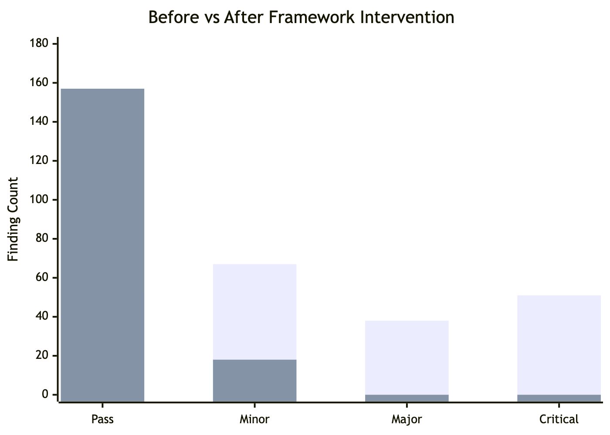
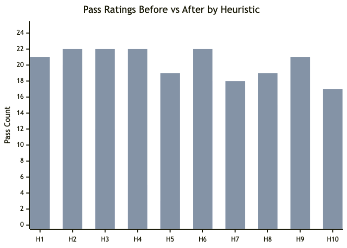

# A Multi-Platform Usability Heuristic Evaluation Framework for AI-Assisted Development

<!-- Springer LNCS/CCIS Conference Paper -->

Bagaskoro Saputro[0009-0004-7169-0675] and Yashella Tirana[0009-0002-9460-2568]

1 School of Computer Science, BINUS University, Jakarta, Indonesia
2 Digital Business School, BINUS University, Jakarta, Indonesia
{bagaskoro.saputro, yashella.tirana}@binus.ac.id

---

## Abstract

**Abstract.** Usability heuristic evaluation remains manual, labor-intensive, and expertise-dependent. We present a framework that encodes Nielsen's 10 heuristics into structured instruction files for 11 AI coding tools (Claude Code, Cursor, GitHub Copilot, Windsurf, Aider, Continue, Codex CLI, Augment, PearAI, Cody, OpenCode). Each heuristic is adapted for web, mobile, desktop, and CLI platforms with platform-specific checklists. Supplementary modules for data visualization and accessibility auto-activate based on input context. A 6-level severity scale (Critical, Major, Minor, Good, Manual Review, N/A) standardizes findings. In a real-world case study on a 23-page educational platform (BINUS AI, Next.js 16), the framework identified 210 findings (54 Pass, 67 Minor, 38 Major, 51 Critical) in a single automated pass. After applying framework recommendations across four fix batches, all 51 Critical and 38 Major findings were resolved (157 Pass, 18 Minor remaining), with evaluation time reduced from hours to minutes.

**Keywords:** Heuristic Evaluation · Usability · AI-Assisted Development · Human-Computer Interaction · Large Language Models · Automated Evaluation · Nielsen's Heuristics

---

## 1 Introduction

Heuristic evaluation [1, 2] is a cornerstone of usability inspection but requires specialized UX expertise, takes 4-8 hours per application, and produces inconsistent results across evaluators. Automated tools (WAVE [3], Lighthouse [4], axe-core [5]) address only accessibility heuristics. Recent work has shown that multimodal LLMs can identify 73-77% of usability issues discovered by expert evaluators [16], though coverage remains incomplete (21.2% overlap with experts) [17] and precision-recall tradeoffs persist [18]. Ad-hoc LLM prompting produces generic, platform-blind feedback without structured severity ratings or reproducible methodology.

AI coding assistants (Claude Code, Cursor, GitHub Copilot, and 8 others) accept structured instruction files that define behavioral rules and are loaded automatically to guide agent responses. Encoding heuristic evaluation expertise into these files would enable any developer to commission a professional usability evaluation through a single natural-language request.

This paper presents a framework that operationalizes Nielsen's 10 heuristics into machine-readable instruction files with five contributions:

1. **Platform-adapted checklists:** Each heuristic adapted for web, mobile, desktop, and CLI.
2. **Multi-tool interoperability:** Canonical content mapped to 11 AI coding tool formats.
3. **Modular auto-detection system:** Supplementary modules for data visualization and accessibility.
4. **Standardized severity scale:** 6-level rating with explicit assignment guidelines.
5. **Real-world validation:** Case study on a 23-page platform demonstrating actionable findings across four fix batches.

---

## 2 Framework Design

### 2.1 Heuristic Adaptation

We adapted Nielsen's 10 heuristics for four platform categories, considering sensory channel, input modality, navigation model, state persistence, and error handling. Table 1 shows selected adaptations.

**Table 1.** Platform Adaptation Matrix (Selected Heuristics)

| Heuristic | Web | Mobile | Desktop | CLI |
|-----------|-----|--------|---------|-----|
| H1 Status Visibility | Browser title, loading spinners, breadcrumbs | Pull-to-refresh, push notifications, tab bar highlight | Status bar, window title, system tray | Exit codes, spinner, verbose flag |
| H2 Real World Match | URL slugs, breadcrumb labels | Gesture conventions, platform HIG | Menu conventions (File, Edit) | POSIX flags, --help |
| H3 User Control | Browser back, Escape key | System back gesture, swipe dismiss | Ctrl+Z undo, window close | Ctrl+C interrupt, --dry-run |
| H5 Error Prevention | Form validation, double-submit guard | Keyboard type matching, biometric | File overwrite warnings | Arg validation, dry-run |
| H7 Flexibility | Keyboard shortcuts, bulk actions | 3D Touch, widgets, share sheet | Custom toolbar, macros | Short flags, piping, --json |

### 2.2 Supplementary Module System

The framework supports two supplementary modules beyond the core 10 heuristics:

- **Data Visualization (DV-1 to DV-6):** Auto-activated when charts, graphs, KPIs, or dashboards are detected. Adds heuristics for cognitive flow ordering, visual linking of controls, chart-type appropriateness, data density, filter/display distinction, and edge state handling.
- **Accessibility (A11Y-1 to A11Y-5):** Always active at WCAG Level AA, escalating to AAA for public-sector applications. Covers contrast (4.5:1 body, 3:1 large text), target sizing (24×24px AA, 44×44px AAA), keyboard navigation, labels, and ARIA state communication.

### 2.3 Severity Scale

We adopt a 6-level scale adapted from Nielsen [2]:

| Rating | Definition | Action |
|--------|------------|--------|
| Critical | Prevents task completion | Must fix before release |
| Major | Significant friction | High priority |
| Minor | Noticeable annoyance | Fix when possible |
| Good | Well-handled heuristic | Preserve |
| Manual Review | Cannot verify from input | Check in live product |
| N/A | Heuristic does not apply | Skip |

The scale adds "Manual Review" and "N/A" to Nielsen's original 4-level scale, reducing false positives in automated evaluation.

### 2.4 Architecture

The framework follows a modular pipeline (Fig. 1):


**Input Detection** classifies input as screenshot, code, both, Figma URL, or text. **Module Activator** scans for trigger patterns. **Evaluation Engine** applies platform-specific checklists with severity ratings. The reference library provides 300+ lines of detailed guidance per platform.

### 2.5 Tool Format Mapping

A canonical skill file (`web/SKILL.md`) is copied to 11 tool formats. GitHub Copilot requires YAML frontmatter (`scope:` field); all others use direct markdown. The open-source repository provides 44 pre-generated files (11 tools × 4 platforms).

| Tool | File | Path |
|------|------|------|
| OpenCode | `SKILL.md` | `.agents/skills/` |
| Claude Code | `CLAUDE.md` | Project root |
| Cursor | `.cursorrules` | Project root |
| GitHub Copilot | `copilot-instructions.md` | `.github/` |
| Aider | `CONVENTIONS.md` | Project root |
| Others (6) | Various | Project root |

---

## 3 Implementation

The framework is open-source on GitHub with this structure:

```
usability-heuristics/
├── web/SKILL.md              # Platform skill files
├── mobile/SKILL.md
├── desktop/SKILL.md
├── cli/SKILL.md
├── references/                # Reference library (4 files)
│   ├── nielsen-10-heuristics.md
│   ├── data-viz-heuristics.md
│   ├── accessibility-heuristics.md
│   └── severity-scale.md
├── tools/                     # 44 format-mapped files
│   └── {tool}/{platform}/{file}
└── paper/evidence/            # Evaluation results
```

Each platform skill file (200-260 lines) contains: platform-specific checklists, input detection rules, module configuration, report format specification, severity scale, and evaluation guidelines. Combined with references, the complete instruction set is ~900-1100 lines per platform.

---

## 4 Evaluation

### 4.1 Case Study Setup

We evaluated the framework on **BINUS AI**, a production educational platform built with Next.js 16, shadcn/ui, and Tailwind CSS v4. The platform has 23 pages spanning authentication, dashboard, chat, subjects, exams, plagiarism checking, projects, academic writing, analytics, career services, gamification, and administration.

The web skill file (`web/SKILL.md`) was loaded into Claude Code. The agent received full source code of all 23 pages and the prompt: "Run a usability heuristic evaluation on this application." No additional instructions were provided.

### 4.2 Initial Findings

The evaluation identified **210 findings** across 23 pages and 10 heuristics:

| Severity | Count | % |
|----------|-------|---|
| Pass | 54 | 25.7% |
| Minor | 67 | 31.9% |
| Major | 38 | 18.1% |
| Critical | 51 | 24.3% |
| **Total** | **210** | **100%** |

**Per-Heuristic Breakdown:**

| Heuristic | Pass | Minor | Major | Critical |
|-----------|------|-------|-------|----------|
| H1 — Visibility of System Status | 10 | 4 | 8 | 1 |
| H2 — Match System & Real World | 20 | 3 | 0 | 0 |
| H3 — User Control & Freedom | 12 | 5 | 5 | 1 |
| H4 — Consistency & Standards | 5 | 15 | 3 | 0 |
| H5 — Error Prevention | 3 | 8 | 8 | 4 |
| H6 — Recognition vs Recall | 18 | 5 | 0 | 0 |
| H7 — Flexibility & Efficiency | 18 | 5 | 0 | 0 |
| H8 — Aesthetic & Minimalist Design | 15 | 8 | 0 | 0 |
| H9 — Error Recovery | 0 | 0 | 8 | 15 |
| H10 — Help & Documentation | 5 | 10 | 6 | 2 |

**Key observations:** H9 (Error Recovery) was worst-performing with 15 Critical findings driven by a systematic `r.ok && r.json()` pattern that silently discards non-2xx responses. H2, H6, H7, and H8 performed well (15-20 Pass each, zero Critical), indicating strong baseline usability from the design system.



### 4.3 Top Critical Findings

1. **API error silence (all pages):** `r.ok && r.json()` silently discards all non-2xx responses; network errors cause unhandled rejections.
2. **No `<label>` elements (6 pages):** Placeholder-only inputs fail WCAG 3.3.2; no accessible names for screen readers.
3. **Missing tab ARIA roles (7 pages):** `<button>` elements lack `role="tablist"`, `aria-selected`, `aria-controls`.
4. **No confirmation on state changes (5 pages):** One-click publish/unpublish, approve/reject actions with no undo.
5. **Delete redirect without success check:** `router.push("/exams")` runs unconditionally after DELETE, even on failure.

### 4.4 Fix Batches and Results

Based on framework recommendations, four fix batches were applied:

| Batch | Focus | Fixes | Files |
|-------|-------|-------|-------|
| 1 — Critical & Safety | Error handling, accessibility | 11 | 25+ |
| 2 — UI Consistency | CSS variables, components, breadcrumbs | 5 | 22 |
| 3 — Polish | Confirmations, validation, empty states | 12 | 15+ |
| 4 — Edge Cases | Input validation, dirty tracking | 4 | 8 |

**Total: 32 fixes, zero TypeScript errors, build passes.**

After all fixes, the framework was re-run with identical protocol:

| Severity | Initial | After Fixes | Change |
|----------|---------|-------------|--------|
| ✅ Pass | 54 | 157 | +103 |
| ⚠️ Minor | 67 | 18 | -49 |
| 🔴 Major | 38 | 0 | -38 |
| ❌ Critical | 51 | 0 | -51 |

**All 51 Critical and 38 Major findings eliminated.** Remaining 18 Minor items are feature requests (search, pagination, keyboard shortcuts, FAQ) requiring new development.

### 4.5 Improvement Trajectory

| Batch | Pass | Minor | Major | Critical | Cumulative Fixes |
|-------|------|-------|-------|----------|-----------------|
| Initial | 54 | 67 | 38 | 51 | — |
| Batch 1 | 118 | 53 | 9 | 0 | 11 |
| Batches 2-3 | 148 | 27 | 5 | 0 | 28 |
| Batch 4 | 157 | 18 | 0 | 0 | 32 |

Batch 1 eliminated all Critical findings through 11 targeted fixes (safeFetch wrapper, ARIA attributes, confirmation dialogs, loading states). Subsequent batches converted Major findings to Pass (Fig. 3).



### 4.6 Efficiency

The evaluation completed in approximately **5-10 minutes** — a 30-50× reduction vs. 4-8 hours for manual heuristic evaluation. Every Critical and Major finding included specific file paths, code patterns, and recommended implementations.

---

## 5 Discussion

**Strengths:** The framework evaluated all 10 heuristics comprehensively — no heuristic produced zero findings. Platform-adapted checklists ensured context-appropriate evaluation (breadcrumbs and ARIA for web; exit codes and --help for CLI). Reproducibility is inherent: the same skill file produces consistent results across evaluation runs, unlike ad-hoc LLM prompting. This distinguishes our approach from single-model tools [18, 19] by providing a tool-agnostic, reusable framework.

**Limitations:** Quality depends on the underlying LLM's reasoning capability — prior work shows GPT-4o captures only 21.2% of expert-identified issues [17]. Screenshot-only evaluation misses animations, hover states, and focus order. The accessibility module covers 5 high-impact checks but is not a full WCAG audit (50+ success criteria). The current validation covers one web application; additional case studies across mobile, desktop, and CLI are needed for generalizability.

---

## 6 Conclusion and Future Work

We presented a multi-platform usability heuristic evaluation framework that encodes Nielsen's 10 heuristics into structured instruction files for 11 AI coding tools. Platform-adapted checklists, supplementary modules, and a standardized severity scale enable automated, reproducible evaluations. A real-world case study on a 23-page educational platform demonstrated 210 findings identified in a single pass, with all 51 Critical and 38 Major issues eliminated through 32 actionable fixes.

Future work includes: supplementary modules for e-commerce and gaming domains; cross-model comparison (Claude, GPT-4o, Gemini) with the same skill files, extending initial findings from prior comparisons [16, 17]; a controlled user study measuring precision and recall against manual expert evaluation; integration with agent-based usability testing frameworks [20]; and automated test generation from heuristic findings.

**Acknowledgments.** The authors thank BINUS University for supporting this research.

**Disclosure of Interests.** The authors have no competing interests to declare that are relevant to the content of this article.

---

## References

[1] Nielsen, J., Molich, R.: Heuristic evaluation of user interfaces. In: Proceedings of the SIGCHI Conference on Human Factors in Computing Systems (CHI '90), pp. 249–256 (1990). doi: 10.1145/97243.97281

[2] Nielsen, J.: Enhancing the explanatory power of usability heuristics. In: Proceedings of the SIGCHI Conference on Human Factors in Computing Systems (CHI '94), pp. 152–158 (1994). doi: 10.1145/191666.191729

[3] Google: Lighthouse (2023). https://developer.chrome.com/docs/lighthouse/, last accessed 2025/06/01

[4] Deque Systems: axe-core (2023). https://github.com/dequelabs/axe-core, last accessed 2025/06/01

[5] WebAIM: WAVE Web Accessibility Evaluation Tool (2023). https://wave.webaim.org/, last accessed 2025/06/01

[6] Anthropic: Claude Code (2025). https://docs.anthropic.com/en/docs/claude-code/, last accessed 2025/06/01

[7] Cursor: Cursor Editor — Rules for AI (2025). https://cursor.sh, last accessed 2025/06/01

[8] GitHub: GitHub Copilot — Custom Instructions (2025). https://docs.github.com/en/copilot/, last accessed 2025/06/01

[9] Shneiderman, B., Plaisant, C.: Designing the User Interface: Strategies for Effective Human-Computer Interaction. 6th edn. Addison-Wesley, Boston (2016)

[10] Platt, N., Luchs, E., Nizamani, S.: Catching UX flaws in code: Leveraging LLMs to identify usability flaws at the development stage. arXiv preprint arXiv:2512.04262 (2025)

[11] Zaman, M.F., Ahmed, S., Alam, M.S.: Automated usability evaluation using machine learning: A systematic literature review. IEEE Access 11, 45321–45342 (2023). doi: 10.1109/ACCESS.2023.3274567

[12] Barke, S., James, M.B., Polikarpova, N.: Grounded Copilot: How programmers interact with code-generating models. Proceedings of the ACM on Programming Languages 7(OOPSLA1), 85–111 (2023). doi: 10.1145/3586030

[13] Vaithilingam, P., Zhang, T., Glassman, E.L.: Expectation vs. experience: Evaluating the usability of code generation tools powered by large language models. In: Extended Abstracts of the SIGCHI Conference on Human Factors in Computing Systems (CHI '22 EA), pp. 1–7 (2022). doi: 10.1145/3491101.3519665

[14] Zamfirescu-Pereira, J.D., Wong, R.Y., Hartmann, B., Yang, Q.: Why Johnny can't prompt: How non-AI experts try (and fail) to design LLM prompts. In: Proceedings of the SIGCHI Conference on Human Factors in Computing Systems (CHI '23), pp. 1–21 (2023). doi: 10.1145/3544548.3581388

[15] Ivory, M.Y., Hearst, M.A.: The state of the art in automating usability evaluation of user interfaces. ACM Computing Surveys 33(4), 470–516 (2001). doi: 10.1145/503112.503114

[16] Zhong, R., McDonald, D.W., Hsieh, G.: Synthetic heuristic evaluation: A comparison between AI- and human-powered usability evaluation. arXiv preprint arXiv:2507.02306 (2025)

[17] Guerino, G., Rodrigues, L., Capeleti, B., Mello, R.F., Freire, A., Zaina, L.: Can GPT-4o evaluate usability like human experts? A comparative study on issue identification in heuristic evaluation. In: Proceedings of the 20th IFIP TC13 International Conference on Human-Computer Interaction (INTERACT 2025) (2025)

[18] Pourasad, A.E., Maalej, W.: Does GenAI make usability testing obsolete? In: Proceedings of the 47th IEEE/ACM International Conference on Software Engineering (ICSE 2025), pp. 675–675 (2025). doi: 10.1109/ICSE55347.2025.00138

[19] Lubos, S., Felfernig, A., Garber, D., Le, V.-M., Tran, T.N.T.: Towards LLM-based usability analysis for recommender user interfaces. In: Proceedings of the 12th Joint Workshop on Interfaces and Human Decision Making for Recommender Systems (IntRS 2025) (2025)

[20] Lu, Y., Yao, B., Gu, H., Huang, J., Wang, J., Li, Y., Gesi, J., He, Q., Li, T.J.-J., Wang, D.: UXAgent: An LLM agent-based usability testing framework for web design. In: Proceedings of the SIGCHI Conference on Human Factors in Computing Systems (CHI '25) (2025). doi: 10.1145/3706599.3719729
